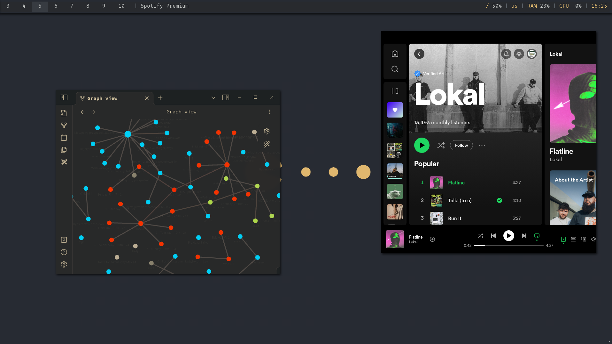
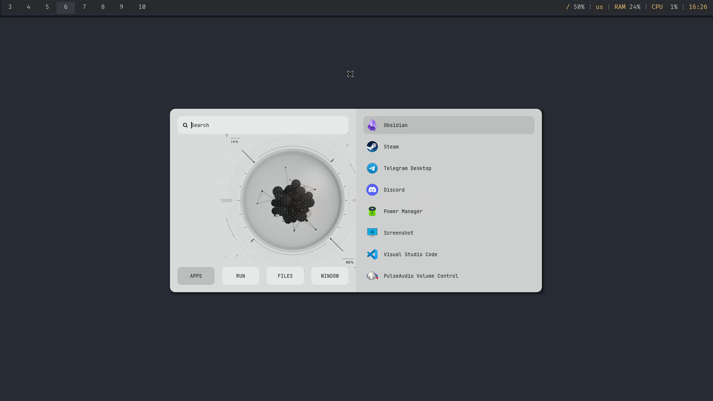
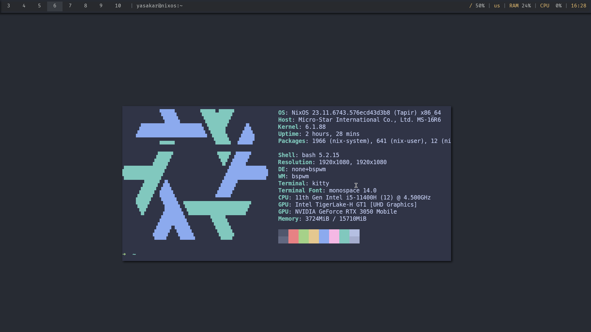
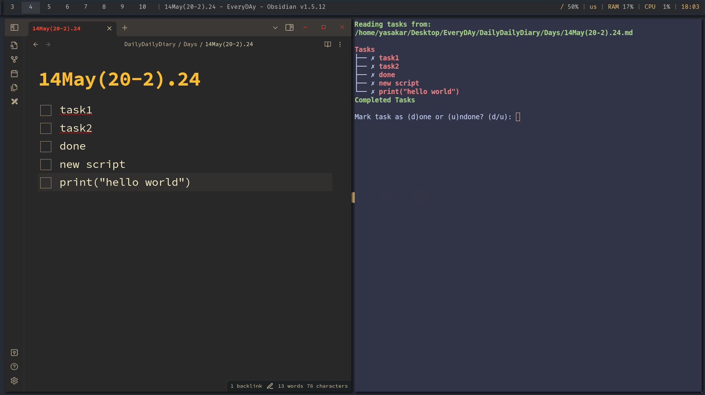
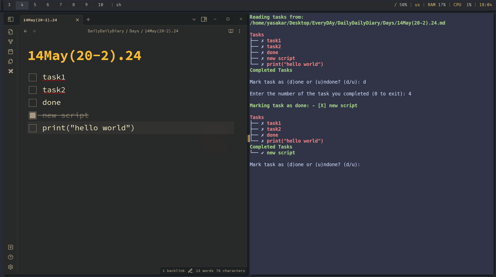

Markdown
# 💻 MyDotFiles | NixOS & BSPWM Configuration

Welcome to my personal declarative development environment configuration. This repository contains my system dotfiles, automated scripting pipelines, and environment setups tailored for high-performance software engineering, data engineering, and audio production.

---

## 🚀 Key Features

- **OS Core:** **NixOS** – Driven by full declarative reproducibility utilizing `configuration.nix`.
- **User Space Management:** Managed entirely via `home-manager` for isolated, modular user configurations.
- **Window Management & Workflow:** **BSPWM** (Binary Space Partitioning Window Manager) paired with `sxhkd` for seamless, keyboard-driven navigation.
- **Bar & Launchers:** Highly customized `polybar` for resource tracking, paired with `rofi` for dynamic application launching.
- **Terminal Setup:** `kitty` terminal coupled with highly optimized `nvim` (Neovim) configurations for lightning-fast coding.
- **Compositor & Visuals:** `picom` configuration providing smooth rendering and zero-latency window effects.

---

## 🛠 Automation & Productivity Tools

Inside the root directory, you will find my custom automation tools:
- `custom_tasks.py` & `new_tasks.py`: Lightweight Python-based CLI utilities designed to parse, track, and sync my daily tasks directly from plain-text journals. It provides structured console logs to maintain a distraction-free daily pipeline.

---

## 🎵 Audio Production & Dual Boot Strategy

As a **beatmaker and audio producer** (handling sound engineering, commercials, and soundtracks), my workflow demands a bulletproof ecosystem. 

While NixOS is my primary weapon for software engineering, I maintain a highly optimized **dual-boot configuration with Windows** for seamless audio performance within **Ableton Live**. Although running Ableton via compatibility layers (Wine) is fully functional on Linux, natively booting into Windows handles low-latency ASIO audio drivers and heavy VST/plugin parsing much more efficiently for rapid professional music production.

---

## 📸 Screenshots

#### Tasks:

